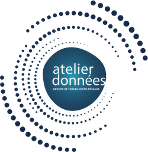

# Les auteurs

Ce guide de bonnes pratiques sur la gestion des données dans les réseaux métiers, a été réalisé par  :

* Christine Hadrossek : [DDOR](https://www.cnrs.fr/fr/personne/direction-information-scientifique-et-technique), [réseau Renatis](http://renatis.cnrs.fr/)
* Joanna Janik : [DDOR](https://www.cnrs.fr/fr/personne/direction-information-scientifique-et-technique), [réseau Renatis](http://renatis.cnrs.fr/)
* Maurice Libes : [réseau SIST](http://sist.cnrs.fr)
* Violaine Louvet : [réseau Calcul](https://calcul.math.cnrs.fr/)
* Marie-Claude Quidoz : [réseau rBDD](http://rbdd.cnrs.fr/)
* Alain Rivet : [réseau QeR](http://qualite-en-recherche.cnrs.fr/)
* Geneviève Romier : [réseau rBDD](http://rbdd.cnrs.fr/)

## Relecteurs
* Pierre Brochard : [réseau DevLog](http://devlog.cnrs.fr/)
* Dominique Desbois : [réseau DevLog](http://devlog.cnrs.fr/)
* Emilie Lerigoleur : [réseau SIST](http://sist.cnrs.fr)
* Caroline Martin :
* Pierre Navaro : [réseau Calcul](https://calcul.math.cnrs.fr/)
* Jean-Michel Parret : [INIST](https://www.inist.fr/)

- **version 1.0 Janvier 2021**

## Licence 

Cet ouvrage est mis à disposition selon les termes de la licence Creative Commons CC BY 4.0

[](https://creativecommons.org/licenses/by/4.0/deed.fr)


````{panels}
[](https://mi-gt-donnees.pages.math.unistra.fr/site/)
---
[](http://www.cnrs.fr/mi/spip.php?article465)
````

*Mise en page et logo - Pierre Navaro*
